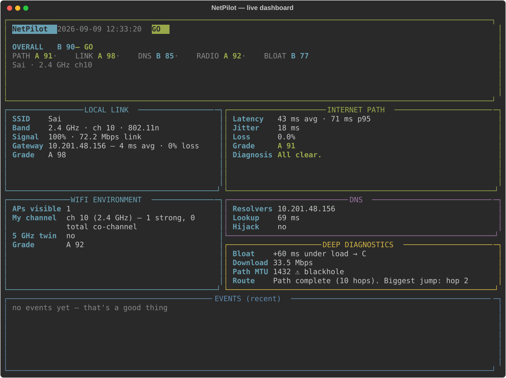
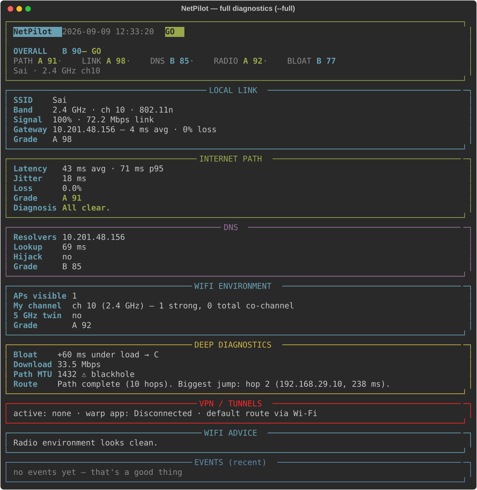

# NetPilot 📡

[](https://github.com/Sainath-Reddy7/netpilot/actions/workflows/ci.yml)
[](https://www.python.org/)
[](https://github.com)
[](LICENSE)

**A comprehensive network health monitor for Windows** — built after two days of
fighting hostel Wi-Fi and mobile hotspot congestion. NetPilot measures everything
that actually makes a network *feel* bad, tells you exactly **which layer is the
problem**, and learns **when your networks are usable** over time.

> Speedtests measure Mbps. NetPilot measures what hurts: latency, jitter, packet
> loss, bufferbloat, DNS behavior, radio congestion — layer by layer.

## Screenshots

**Live dashboard** (`python netpilot.py`):



**Full diagnostics** (`python netpilot.py --full` — traceroute, bufferbloat,
throughput, path MTU, channel scan, VPN detection):



## What it measures (and why)

| Domain | What | Why it matters |
|---|---|---|
| **Local link** | latency/loss to your gateway | isolates "laptop ↔ router" problems (distance, interference, adapter sleep) |
| **Internet path** | latency, jitter, p95, loss to multiple targets | the core "is my network usable" signal |
| **Route** | hop-by-hop traceroute analysis | pinpoints *where* on the path the pain starts (e.g. carrier CGNAT) |
| **Bufferbloat** | latency under download load | the classic "everything lags when someone downloads" — invisible to speedtests |
| **Throughput** | quick download Mbps | measured during the bloat test, free of charge |
| **DNS** | resolver identification, lookup latency, **hijack detection** | campus/captive portals intercepting DNS cause mystery redirects and stalls |
| **Radio environment** | channel scan of all nearby APs, co-channel congestion, 5 GHz availability | "your channel has 11 strong neighbours" and "your SSID also has a 5 GHz twin — switch" |
| **Path MTU** | DF-ping binary search | detects silent large-packet blackholes (common with VPNs/firewalls) |
| **VPN awareness** | detects WARP / WireGuard / Tailscale / OpenVPN | measurements are interpreted differently when tunneled |
| **Events** | disconnects, AP roaming, outages, DNS failures | a timeline of *incidents*, with availability % |

Everything runs with **no admin rights** and only uses built-in Windows tools
(`ping`, `netsh`, `route`, `tracert`) — nothing sketchy, nothing phoning home.

## Install

Python 3.10+ on Windows.

```bash
pip install -r requirements.txt   # rich, pandas, matplotlib
pip install plyer                 # optional: Windows toast notifications
```

## Usage

```bash
python netpilot.py                    # live dashboard (Ctrl+C to stop)
python netpilot.py --once             # quick check → exit code 0 GO / 1 WARN / 2 DEAD
python netpilot.py --full             # deep diagnostics (~1 min: traceroute, bufferbloat,
                                      #   throughput, path MTU, channel scan, VPN detect)
python netpilot.py --report           # heatmap + schedules + incidents + HTML report
python netpilot.py --report --days 14
python netpilot.py --auto "MyHotspot" # auto-switch to a saved Wi-Fi after 30s of DEAD
python netpilot.py --deep-interval 15 # live mode: deep diagnostics every 15 min
```

**The routine:** run `--full` once per network to meet it, keep the live monitor
running when you care, and check `--report` after a few days to learn your
networks' schedules.

## Scoring

Each domain gets a 0–100 score and a letter grade (A ≥90, B ≥75, C ≥60, D ≥40, else F).
The overall score is a weighted roll-up (path 45%, link 25%, DNS 15%, radio 15%,
+20% bufferbloat when tested); untested domains are dropped and weights
renormalized, so a light cycle still scores fairly.

Verdict thresholds (tunable in `config.json`):

| Verdict | Meaning | Real-world anchor |
|---|---|---|
| **GO** (≥75) | do your thing | 48 ms / 0% loss ≈ 93 |
| **WARN** (40–74) | usable, expect stutters | ~6% loss |
| **DEAD** (<40) | switch networks or wait | 217 ms avg, wild jitter |

Some campus APs ignore pings to the gateway — NetPilot detects this and refuses
to blame your local link for it.

## Reports

`python netpilot.py --report` produces:

- `reports/netpilot_report.png` — hour-of-day congestion heatmap per network
  (median latency + mean loss)
- `reports/netpilot_report.html` — standalone shareable report: embedded heatmap,
  per-network healthy/dead hour schedules, recent incidents, availability %
- console summary, e.g.

```
Campus-5G (3810 samples) — overall 71/100
  healthy hours: 09:00-18:00
  dead hours:    19:00-23:00
Phone    (922 samples)  — overall 88/100
  healthy hours: 07:00-09:00, 23:00-07:00
  dead hours:    20:00-22:00

Availability (uptime while monitored): 96.42%
```

Leave the monitor running overnight (plugged in) to map your networks properly.

## Project layout

```
netpilot.py     CLI + monitoring engine (light cycles, deep cycles, alerts, auto-switch)
prober.py       ping/netsh/route wrappers — all raw Windows-tool parsing
health.py       rolling stats, per-domain scores, grades, roll-up, diagnosis
dashboard.py    the rich layout (live dashboard + full report rendering)
wifi_env.py     channel congestion analysis from BSSID scans
dnscheck.py     resolver detection, lookup latency, NXDOMAIN hijack test
bloat.py        bufferbloat (latency under load) + throughput
traceroute.py   hop-by-hop path analysis, loss localization
mtu.py          path MTU / blackhole detection via DF pings
vpndetect.py    WARP/WireGuard/Tailscale/OpenVPN detection
events.py       incident detection (outages, roaming, DNS fails) + timeline
logger.py       CSV logging (schema v2, auto-migrates v1 files)
report.py       heatmap, schedules, incidents, availability, HTML export
notify.py       Windows toast notifications (plyer) with console fallback
scripts/        maintenance scripts (screenshot generation)
```

## Notes & limits

- Windows-only for now (the probe layer parses `ping`/`netsh`/`route`/`tracert` output).
- Deep diagnostics download ~10 MB (bufferbloat test) — skip on metered connections
  or tune `bloat.url` bytes in the config.
- Logs and reports stay in `logs/` and `reports/` — they contain your SSIDs, and
  both folders are git-ignored by default.
- Auto-switch connects only to **saved** Wi-Fi profiles, only if visible, and backs
  off for 5 minutes after each attempt.

## Roadmap

- Upload-direction bufferbloat test
- Long-baseline stats: week-over-week network quality trends
- Auto toggle VPN (WireGuard/WARP) on verdict changes
- Linux/macOS support (probe abstraction)
- Optional system-tray build (pystray)

## License

[MIT](LICENSE) © 2026 Sainath Reddy

---

Born from a real situation: campus Wi-Fi that needs a VPN, a WireGuard box on AWS
Mumbai, a phone hotspot that dies at 8 pm, and way too many teleports in Valorant.
